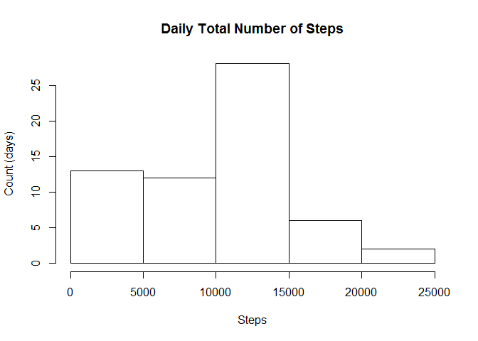
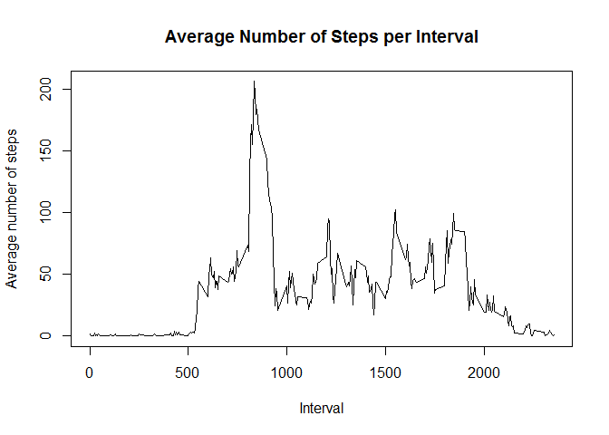
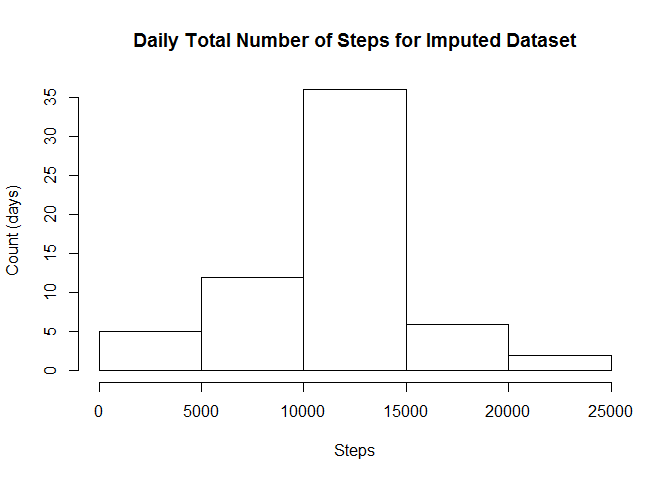
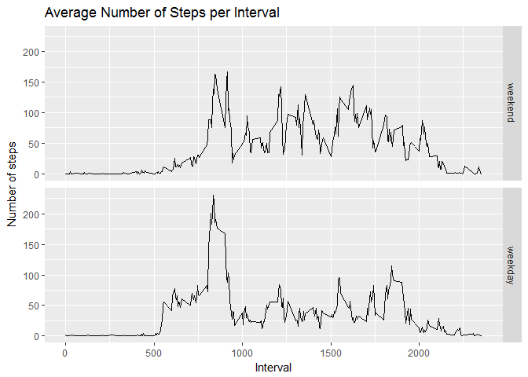

# Reproducible Research: Peer Assessment 1
Nancy Irisarri  
April 28, 2017  

## Loading and preprocessing the data
We choose the function `read.csv` and pass options for indicating that the file has a header and that NAs should be removed.


```r
data <- read.csv("activity.csv", header=TRUE, na.strings=NA)
```


## What is mean total number of steps taken per day?  
We begin by loading the necessary libraries. 


```r
library(dplyr)
library(ggplot2)
```

We will concatenate commands with the operator `%>%`. First we group the data by the *date* column with the `group_by` function. Next we make a column to keep the daily total number of steps by calling the `summarize` function. We pass to it the desired column name *dailySum* and the function that we need, in this case `sum`. Since there might be NAs in the data we also pass the option `na.rm=TRUE` to remove them.


```r
result <- data %>% group_by(date) %>% summarize(dailySum = sum(steps, na.rm=TRUE))
```

With this result we make a histogram of the total number of steps taken each day.


```r
hist(result$dailySum, xlab="Steps", ylab="Count (days)", main="Daily Total Number of Steps")
```

<!-- -->

The mean and median of the total number of steps taken per day are below.


```r
meanResult <- mean(result$dailySum, na.rm=TRUE)
meanResult
```

```
## [1] 9354.23
```

```r
medianResult <- median(result$dailySum, na.rm=TRUE)
medianResult
```

```
## [1] 10395
```


## What is the average daily activity pattern?
We again concatenate commands with the operator `%>%`. Start by grouping the data by the *interval* column and make a new column to keep the average number of steps taken, averaged across all days. Since there might be NAs in the data we also pass the option `na.rm=TRUE` to remove them.


```r
intMeans <- data %>% group_by(interval) %>% summarize(intMean = mean(steps, na.rm=TRUE))
```

Next we plot a time series of the 5-minute intervals and the averages.


```r
plot(intMeans$interval, intMeans$intMean, type="l", xlab="Interval", ylab="Average number of steps", lwd=1, main="Average Number of Steps per Interval")
```

<!-- -->

The 5-minute interval with the maximum number of steps is interval 835. Below the calculation.


```r
intMeans %>% filter(intMean == max(intMean))
```

```
## # A tibble: 1 × 2
##   interval  intMean
##      <int>    <dbl>
## 1      835 206.1698
```


## Imputing missing values
We calculate the total number of rows with NAs by using `is.na()` for indexing the data frame with all the data. Then we find the length of that vector. The total is 2,304 as seen below.


```r
length(data[is.na(data$steps),1])
```

```
## [1] 2304
```

We choose to fill in missing values with the mean for that 5-minute interval averaged across all days. We make a `counter` variable so that we can take the mean corresponding to a certain interval. The loop goes through the rows of the *steps* column and when an NA is found it is substituted by the mean for that interval. This mean is extracted from the `intMeans` data frame using the mentioned `counter` variable. In order to extract the mean for one of the 288 intervals, the counter is increased by 1 and reset when it is equal to 289. The new dataset is stored in a new data frame.


```r
dataFilled <- data

counter <- 1

for (i in 1:length(dataFilled$steps)) {
  if (is.na(dataFilled$steps[i])) {
    dataFilled$steps[i] <- intMeans$intMean[counter]
  }
  
  counter <- counter + 1
  
  if (counter == 289) {
    counter <- 1
  }
}
```

As we can see there are now no NAs in this new dataset.


```r
length(dataFilled[is.na(dataFilled$steps),1])
```

```
## [1] 0
```

Next we make a histogram of the total number of steps taken each day. To make it we group the imputed dataset by date and make a column for the total number.


```r
resultFilled <- dataFilled %>% group_by(date) %>% summarize(dailySum = sum(steps, na.rm=TRUE))

hist(resultFilled$dailySum, xlab="Steps", ylab="Count (days)", main="Daily Total Number of Steps for Imputed Dataset")
```

<!-- -->

The mean and median total number of steps taken per day for the imputed dataset are as follows. 


```r
meanFilled <- mean(resultFilled$dailySum, na.rm=TRUE)
meanFilled
```

```
## [1] 10766.19
```

```r
medianFilled <- median(resultFilled$dailySum, na.rm=TRUE)
medianFilled
```

```
## [1] 10766.19
```

The mean for the original dataset is 9354.2295082 while for the imputed dataset is 1.0766189\times 10^{4}. This is a difference of 1411.959171. Meanwhile the median for the original and imputed dataset is 10395 and 1.0766189\times 10^{4}, respectively. Thus the change in the median is 371.1886792. The impact in both the mean and median of imputing missing data with the chosen strategy is an increase in the estimates of the total daily number of steps.


## Are there differences in activity patterns between weekdays and weekends?
We use the data with the filled-in missing values and start by making a factor based on the *date* column. The date is converted to `Date` so that we can determine which day of the week it is with the `weekdays()` function. Then we search the day of the week for the characters *Sat* or *Sun* with the `grepl()` function. We label the factor with "weekday" or "weekend" indicating whether the date is a weekday or weekend day. Then we add this factor variable to the dataset with the `mutate()` function.


```r
factorDaytype <- factor(grepl("S(at|un)", weekdays(as.Date(dataFilled$date))), levels=c(TRUE, FALSE), labels=c("weekend", "weekday"))

dataFilled <- dataFilled %>% mutate(daytype = factorDaytype)
```

We make a plot of the 5-minute intervals and the average number of steps taken, averaged across all weekend days (top panel) or weekdays (bottom panel). In order to make it we calculate the means for the imputed dataset grouped by interval and day type.


```r
intMeansFilled <- dataFilled %>% group_by(interval, daytype) %>% summarize(intMean = mean(steps, na.rm=TRUE))

ggplot(intMeansFilled, aes(x=interval, y=intMean)) + geom_line() + facet_grid(daytype ~ .) + 
  ggtitle("Average Number of Steps per Interval") + xlab("Interval") + ylab("Number of steps") + 
  theme(panel.spacing = unit(0.5, "lines"))
```

<!-- -->
