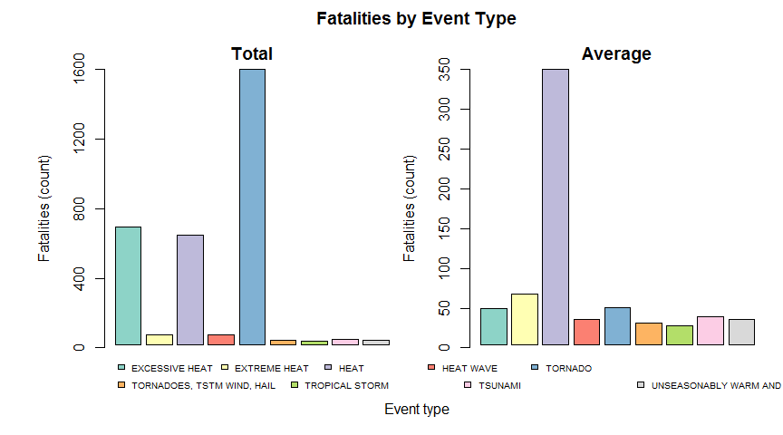

# Impact of Events from the NOAA Storm Database on Population Health and Economy
Nancy Irisarri  
April 29, 2017  


## Synopsis

Severe meteorological phenomena can affect the communities and municipalities where they occur. These events often cause problems on population health as well as financial challenges. Furthermore, the evidence for climate change means that neutralizing the impact of storms and severe weather events should be a priority for policy makers.

In this report we explore the U.S. National Oceanic and Atmospheric Administration's (NOAA) storm database. The database contains information on major storms and weather events in the United States. We will use the stored estimates of fatalities, injuries, and property damage in order to study the most harmful events.

## Data Processing 
We begin by loading the necessary libraries. 


```r
library(dplyr)
library(RColorBrewer)
```

We read in the data from the raw CSV file. The file contains the data in comma-separated values.


```r
noaa <- read.csv("data/repdata_data_storm_data.csv.bz2")
```

Next we check the dimensions of the data and the first few rows.


```r
dim(noaa)
```

```
## [1] 902297     37
```

```r
head(noaa[,1:26])
```

```
##   STATE__           BGN_DATE BGN_TIME TIME_ZONE COUNTY COUNTYNAME STATE
## 1       1  4/18/1950 0:00:00     0130       CST     97     MOBILE    AL
## 2       1  4/18/1950 0:00:00     0145       CST      3    BALDWIN    AL
## 3       1  2/20/1951 0:00:00     1600       CST     57    FAYETTE    AL
## 4       1   6/8/1951 0:00:00     0900       CST     89    MADISON    AL
## 5       1 11/15/1951 0:00:00     1500       CST     43    CULLMAN    AL
## 6       1 11/15/1951 0:00:00     2000       CST     77 LAUDERDALE    AL
##    EVTYPE BGN_RANGE BGN_AZI BGN_LOCATI END_DATE END_TIME COUNTY_END
## 1 TORNADO         0                                               0
## 2 TORNADO         0                                               0
## 3 TORNADO         0                                               0
## 4 TORNADO         0                                               0
## 5 TORNADO         0                                               0
## 6 TORNADO         0                                               0
##   COUNTYENDN END_RANGE END_AZI END_LOCATI LENGTH WIDTH F MAG FATALITIES
## 1         NA         0                      14.0   100 3   0          0
## 2         NA         0                       2.0   150 2   0          0
## 3         NA         0                       0.1   123 2   0          0
## 4         NA         0                       0.0   100 2   0          0
## 5         NA         0                       0.0   150 2   0          0
## 6         NA         0                       1.5   177 2   0          0
##   INJURIES PROPDMG PROPDMGEXP
## 1       15    25.0          K
## 2        0     2.5          K
## 3        2    25.0          K
## 4        2     2.5          K
## 5        2     2.5          K
## 6        6     2.5          K
```

The column headers are properly formated for R data frames.

```r
colnames(noaa)
```

```
##  [1] "STATE__"    "BGN_DATE"   "BGN_TIME"   "TIME_ZONE"  "COUNTY"    
##  [6] "COUNTYNAME" "STATE"      "EVTYPE"     "BGN_RANGE"  "BGN_AZI"   
## [11] "BGN_LOCATI" "END_DATE"   "END_TIME"   "COUNTY_END" "COUNTYENDN"
## [16] "END_RANGE"  "END_AZI"    "END_LOCATI" "LENGTH"     "WIDTH"     
## [21] "F"          "MAG"        "FATALITIES" "INJURIES"   "PROPDMG"   
## [26] "PROPDMGEXP" "CROPDMG"    "CROPDMGEXP" "WFO"        "STATEOFFIC"
## [31] "ZONENAMES"  "LATITUDE"   "LONGITUDE"  "LATITUDE_E" "LONGITUDE_"
## [36] "REMARKS"    "REFNUM"
```

The columns we are interested in in relation to population health are *FATALITIES* and *INJURIES*. In relation to economic consequences the columns *PROPDMG*, *PROPDMGEXP*, *CROPDMG*, and *CROPDMGEXP* are needed. We also need event type which is in the column *EVTYPE*. We extract these columns to have a smaller subset. 


```r
noaa <- noaa %>% select(FATALITIES, INJURIES, PROPDMG, PROPDMGEXP, CROPDMG, CROPDMGEXP, EVTYPE)
```

We explore the class of the columns of the subset.


```r
t(lapply(noaa, class))
```

```
##      FATALITIES INJURIES  PROPDMG   PROPDMGEXP CROPDMG   CROPDMGEXP
## [1,] "numeric"  "numeric" "numeric" "factor"   "numeric" "factor"  
##      EVTYPE  
## [1,] "factor"
```

We see that *PROPDMGEXP* and *CROPDMGEXP* are factors. This means that we need to multiply specific rows of *PROPDMG* and *CROPDMG* with a number corresponding to the levels of the columns *PROPDMGEXP* and *CROPDMGEXP*. We first make a data frame of two columns. One holds the unique levels from *PROPDMGEXP* and *CROPDMGEXP*. The other column we build it to hold the numerical factor which *PROPDMG* and *CROPDMG* should be multiplied by. With this data frame we can loop through the rows corresponding to a level and multiply them by the corresponding factor.


```r
damages <- levels(noaa$PROPDMGEXP)
damages <- c(damages, levels(noaa$CROPDMGEXP))
damages <- unique(damages)
damages <- data.frame(damages, stringsAsFactors=FALSE)
colnames(damages) <- "levels"
damages$levels <- sort(damages$levels)

damageFactors <- data.frame(c(0, 0, 0, 1, 10, 10, 10, 10, 10, 10, 10, 10, 10, 10^9, 10^2, 10^2, 10^3, 10^3, 10^6, 10^6))
colnames(damageFactors) <- "factor"

damages <- cbind(damages, damageFactors)

for (i in 1:length(damages$levels)) {
  level <- damages$levels[i]
  levelFactor <- damages$factor[i]
  
  column <- match("PROPDMG", colnames(noaa))
  noaa[noaa$PROPDMGEXP == level, column] <- noaa[noaa$PROPDMGEXP == level, column] * levelFactor

  column <- match("CROPDMG", colnames(noaa))
  noaa[noaa$CROPDMGEXP == level, column] <- noaa[noaa$CROPDMGEXP == level, column] * levelFactor
}
```

We look at some summary statistics.


```r
summary(noaa$FATALITIES)
```

```
##     Min.  1st Qu.   Median     Mean  3rd Qu.     Max. 
##   0.0000   0.0000   0.0000   0.0168   0.0000 583.0000
```

```r
summary(noaa$INJURIES)
```

```
##      Min.   1st Qu.    Median      Mean   3rd Qu.      Max. 
##    0.0000    0.0000    0.0000    0.1557    0.0000 1700.0000
```

```r
summary(noaa$PROPDMG)
```

```
##      Min.   1st Qu.    Median      Mean   3rd Qu.      Max. 
## 0.000e+00 0.000e+00 0.000e+00 4.736e+05 5.000e+02 1.150e+11
```

```r
summary(noaa$CROPDMG)
```

```
##      Min.   1st Qu.    Median      Mean   3rd Qu.      Max. 
## 0.000e+00 0.000e+00 0.000e+00 5.442e+04 0.000e+00 5.000e+09
```

Immediately we see that there is a large difference between the mean and the maximum values in all of the variables. There are no missing values.

## Results

### Most harmful events with respect to population health
We consider harmful events as events that cause fatalities or injuries. We make histograms to look at the counts and breaks of each of the distributions.


```r
histFatalities <- hist(noaa$FATALITIES)
```

```r
histInjuries <- hist(noaa$INJURIES)
```

```r
histFatalities$counts
```

```
##  [1] 902235     44      9      3      2      2      0      1      0      0
## [11]      0      0      0      0      0      0      0      0      0      0
## [21]      0      0      0      0      0      0      0      0      0      1
```

```r
histFatalities$breaks
```

```
##  [1]   0  20  40  60  80 100 120 140 160 180 200 220 240 260 280 300 320
## [18] 340 360 380 400 420 440 460 480 500 520 540 560 580 600
```

```r
histInjuries$counts
```

```
##  [1] 902107    115     34     10     14      6      1      5      0      0
## [11]      0      2      1      0      0      1      1
```

```r
histInjuries$breaks
```

```
##  [1]    0  100  200  300  400  500  600  700  800  900 1000 1100 1200 1300
## [15] 1400 1500 1600 1700
```

From this we see that the great majority of events cause between 0 and 20 fatalities. Meanwhile most events cause less than 100 injuries. Therefore a good subset of data to look at are events that cause more than 20 fatalities and events that cause more than 100 injuries. The `filter()` function is used to extract the desired rows. To study the fatalities we keep the *FATALITITES* column while for the injuries we keep the *INJURIES* column. Then these are grouped by event type using the `group_by()` function. For clarity we add columns to the subsets to hold the *sum* and *mean*.


```r
subFatalitiesSum <- noaa %>% filter(FATALITIES > 20) %>% select(FATALITIES, EVTYPE) %>% group_by(EVTYPE) %>% summarize(total=sum(FATALITIES))

subFatalitiesMean <- noaa %>% filter(FATALITIES > 20) %>% select(FATALITIES, EVTYPE) %>% group_by(EVTYPE) %>% summarize(means=mean(FATALITIES))

subInjuriesSum <- noaa %>% filter(INJURIES > 100) %>% select(INJURIES, EVTYPE) %>% group_by(EVTYPE) %>% summarize(total=sum(INJURIES))

subInjuriesMean <- noaa %>% filter(INJURIES > 100) %>% select(INJURIES, EVTYPE) %>% group_by(EVTYPE) %>% summarize(means=mean(INJURIES, na.rm=TRUE))
```

We make bar plots of the total number and mean for fatalities by event type.


```r
cols <- brewer.pal(length(subFatalitiesSum$EVTYPE), "Set3")

op<-par(no.readonly=TRUE)
par(op)
par(mfrow=c(1, 2), oma=c(2, 3, 2, 0), mar = c(3, 3, 2, 1))

b <- barplot(subFatalitiesSum$total, axes=FALSE, col=cols, main="Total")
usr <- par("usr")
par(usr=c(usr[1:2], 0, 1600))
axis(2, at=seq(0, 1600, 400))
mtext("Fatalities (count)", side=2, line=3)

legend(x=0,y=-50, as.character(subFatalitiesSum$EVTYPE[1:5]), fill=cols[1:5], cex=0.6, box.lty=0, xpd=NA, horiz=TRUE)
legend(x=0,y=-150, as.character(subFatalitiesSum$EVTYPE[6:9]), fill=cols[6:9], cex=0.6, box.lty=0, xpd=NA, horiz=TRUE)

b <- barplot(subFatalitiesMean$means, axes=FALSE, col=cols, main="Average")
usr <- par("usr")
par(usr=c(usr[1:2], 0, 350))
axis(2, at=seq(0, 350, 50))
mtext("Fatalities (count)", side=2, line=3)

mtext(text="Event type", side=1,line=0, outer=TRUE)

title(main="Fatalities by Event Type", outer=TRUE, cex=0.5)
```



From the left plot in Figure 1 it can be seen that the event type *TORNADO* has caused the highest amount of fatalities (1523), followed by *EXCESSIVE HEAT* (651) and *HEAT* (610). 

The right plot in Figure 1 shows that on average events with type *HEAT* cause the most fatalities (305). The single event in the data that caused the highest amount of fatalities (583) is of type *HEAT* so its average is most likely dominated by that event. The next highest averages correspond to *EXTREME HEAT* (57), *TORNADO* (41.2), and *EXCESSIVE HEAT* (40.7).

We make similar plots of the total number and mean for injuries by event type.


```r
palette17 <- c("dodgerblue2", "#E31A1C", "green4", "#6A3D9A", "#FF7F00", "black", "gold1",
         "skyblue2", "#FB9A99", "palegreen2", "#CAB2D6", "#FDBF6F", "gray70", "khaki2",
         "maroon", "orchid1", "deeppink1")

op<-par(no.readonly=TRUE)
par(op)
par(mfrow=c(1, 2), oma=c(2, 3, 2, 0), mar = c(3, 3, 2, 1))

b <- barplot(subInjuriesSum$total, axes=FALSE, col=palette17, main="Total")
usr <- par("usr")
par(usr=c(usr[1:2], 0, 36000))
axis(2, at=seq(0, 36000, 9000))
mtext("Injuries (count)", side=2, line=3)

legend(x=0,y=-50, as.character(subInjuriesSum$EVTYPE[1:6]), fill=palette17[1:6], cex=0.6, box.lty=0, xpd=NA, horiz=TRUE)
legend(x=0,y=-2500, as.character(subInjuriesSum$EVTYPE[7:12]), fill=palette17[7:12], cex=0.6, box.lty=0, xpd=NA, horiz=TRUE)
legend(x=0,y=-5000, as.character(subInjuriesSum$EVTYPE[13:17]), fill=palette17[13:17], cex=0.6, box.lty=0, xpd=NA, horiz=TRUE)

b <- barplot(subInjuriesMean$means, axes=FALSE, col=palette17, main="Average")
usr <- par("usr")
par(usr=c(usr[1:2], 0, 1600))
axis(2, at=seq(0, 1600, 400))
mtext("Injuries (count)", side=2, line=3)

mtext(text="Event type", side=1,line=0, outer=TRUE)

title(main="Injuries by Event Type", outer=TRUE, cex=0.5)
```


The left plot in Figure 2 shows that *TORNADO* also causes the largest number of injuries (35581), followed by *FLOOD* (5125), and *EXCESSIVE HEAT* (3721). 

The average for *ICE STORM* is dominated by a single event that caused 1568 injuries, which is reflected in the right plot in Figure 2. In the same plot, the next highest averages are for *FLOOD* (512.5) and *HURRICANNE/TYPHOON* (400) events.

### Events with the greatest economic consequences
Here we look at events that have caused property or crop damage. First we make histograms to take a look at the counts and breaks.


```r
histProperty <- hist(noaa$PROPDMG)
```

```r
histCrops <- hist(noaa$CROPDMG)
```

```r
histProperty$counts
```

```
##  [1] 902288      5      1      1      0      0      1      0      0      0
## [11]      0      0      0      0      0      0      0      0      0      0
## [21]      0      0      1
```

```r
histProperty$breaks
```

```
##  [1] 0.00e+00 5.00e+09 1.00e+10 1.50e+10 2.00e+10 2.50e+10 3.00e+10
##  [8] 3.50e+10 4.00e+10 4.50e+10 5.00e+10 5.50e+10 6.00e+10 6.50e+10
## [15] 7.00e+10 7.50e+10 8.00e+10 8.50e+10 9.00e+10 9.50e+10 1.00e+11
## [22] 1.05e+11 1.10e+11 1.15e+11
```

```r
histCrops$counts
```

```
##  [1] 902260     18     15      0      1      0      0      1      0      0
## [11]      0      0      0      0      0      0      0      0      0      0
## [21]      0      0      0      0      2
```

```r
histCrops$breaks
```

```
##  [1] 0.0e+00 2.0e+08 4.0e+08 6.0e+08 8.0e+08 1.0e+09 1.2e+09 1.4e+09
##  [9] 1.6e+09 1.8e+09 2.0e+09 2.2e+09 2.4e+09 2.6e+09 2.8e+09 3.0e+09
## [17] 3.2e+09 3.4e+09 3.6e+09 3.8e+09 4.0e+09 4.2e+09 4.4e+09 4.6e+09
## [25] 4.8e+09 5.0e+09
```

It is evident that the great majority of events cause less than \$5 billion in property damages and less than \$0.2 billion in crop damages. Therefore, we filter the original data to extract events that have caused greater amounts of damage. This is done with similar code used to extract the subset for the impact on population health.


```r
subPropertySum <- noaa %>% filter(PROPDMG > 5.00e+09) %>% select(PROPDMG, EVTYPE) %>% group_by(EVTYPE) %>% summarize(total=sum(PROPDMG))

subPropertyMean <- noaa %>% filter(PROPDMG > 5.00e+09) %>% select(PROPDMG, EVTYPE) %>% group_by(EVTYPE) %>% summarize(means=mean(PROPDMG))

subCropSum <- noaa %>% filter(CROPDMG > 2.00e+08) %>% select(CROPDMG, EVTYPE) %>% group_by(EVTYPE) %>% summarize(total=sum(CROPDMG))

subCropMean <- noaa %>% filter(CROPDMG > 2.00e+08) %>% select(CROPDMG, EVTYPE) %>% group_by(EVTYPE) %>% summarize(means=mean(CROPDMG))
```

We make bar plots for the total number of property and crop damage by event type.


```r
cols <- brewer.pal(length(subPropertySum$EVTYPE), "Set1")

op<-par(no.readonly=TRUE)
par(op)
par(mfcol=c(2, 1), oma=c(2, 6, 1, 0), mar = c(4, 4, 2, 3))

b <- barplot(subPropertySum$total / 10^9, axes=FALSE, col=cols, main="Total Property Damages")
usr <- par("usr")
par(usr=c(usr[1:2], 0, 115.0))
axis(2, at=seq(0, 115.0, 115.0/4))
mtext("Damages ($ billions)", side=2, line=3)

legend(x=0,y=-5, as.character(subPropertySum$EVTYPE[1:3]), fill=cols[1:3], cex=0.6, box.lty=0, xpd=NA, horiz=TRUE)
legend(x=0,y=-20, as.character(subPropertySum$EVTYPE[4]), fill=cols[4], cex=0.6, box.lty=0, xpd=NA, horiz=TRUE)
mtext(text="Event type", side=1, line=2.5)

palette11 <- c("maroon", "orchid1", "deeppink1", "blue1", "steelblue4", "darkturquoise", "green1", "brown", 
         "yellow3", "darkorange4", "yellow4")

b <- barplot(subCropSum$total / 10^9, col=palette11, axes=FALSE, main="Total Crop Damages")
usr <- par("usr")
par(usr=c(usr[1:2], 0, 8))
axis(2, at=seq(0, 8, 1))
mtext("Damages ($ billions)", side=2, line=3)

legend(x=0,y=-0.3, as.character(subCropSum$EVTYPE[1:4]), fill=palette11[1:4], cex=0.6, box.lty=0, xpd=NA, horiz=TRUE)
legend(x=0,y=-1.2, as.character(subCropSum$EVTYPE[5:8]), fill=palette11[5:8], cex=0.6, box.lty=0, xpd=NA, horiz=TRUE)
legend(x=0,y=-2.1, as.character(subCropSum$EVTYPE[9:11]), fill=palette11[9:11], cex=0.6, box.lty=0, xpd=NA, horiz=TRUE)
mtext(text="Event type", side=1,line=0, outer=TRUE)
```


The upper plot in Figure 3 shows that *FLOOD* has in total the greatest impact on property damages. This is most likely due to the worst event in terms of property damage, an event of type *FLOOD* that caused \$115 billion in property damages. The events with next-highest total amount of damages are *HURRICANE/TYPHOON* (\$45.58 billion) and *STORM SURGE* (\$42.56 billion).

The lower plot in Figure 3 shows that *DROUGHT* causes the highest total crop damages (\$7.6 billion). The events *RIVER FLOOD* and *ICE STORM* are close to each other and also have large economic consequences (\$5 billion and \$5 billion). In the subset there is only one event registered for each of *RIVER FLOOD* and *ICE STORM* (compared with 18 for *DROUGHT*) so these were strong events. There are 3 events registered in the subset with *HURRICANE/TYPHOON* causing total crop damages of \$2.2 billion.
